# Mercato Nova — Architecture complète

## 1. Architecture globale

```mermaid
graph TB
    subgraph CLIENT["🖥️ Client — React + Vite + CSS classique  (Astrid)"]
        subgraph PAGES["Pages (18 routes)"]
            PUB["Accueil · Catalogue · Enchères · Détail produit · Fiche enchère"]
            AUTH_P["Connexion · Inscription · Profil"]
            TXN["Panier · Paiement · Négociation"]
            MKT["Mes négociations · Mes ventes · Mes enchères · Notifications"]
            PRO["Nouvelle annonce · Admin demandes · Admin utilisateurs"]
        end
        subgraph CTX["Contextes React"]
            ACTX["AuthContext\n(user, login, logout, register, refreshUser)"]
            CCTX["CartContext\n(cartCount, refreshCart)"]
            NCTX["NotificationContext\n(unreadCount, refreshNotifCount)"]
        end
        subgraph APICLI["api/ — appels fetch centralisés"]
            CLI["client.js\nfetch · CSRF token en mémoire"]
            MODS_F["auth · produits · encheres · negociations\npanier · profil · vendeurs · notifications · admin"]
        end
        subgraph HOOKS["Polling & timers"]
            POLL["Enchères : statut toutes les 3s"]
            TIMER["Timer compte à rebours : toutes les 1s"]
        end
    end

    subgraph BACKEND["⚙️ API REST — PHP 8 sans framework"]
        subgraph SHARED["Fonctions partagées"]
            CFG["setCorsHeaders() · configureSession() · getDB()"]
            MW["requireAuth() · requireRole()\ngenerateCsrfToken() · verifyCsrfToken()"]
            RESP["envoyerJSON()"]
        end
        subgraph MODS["Modules API  /api/"]
            M_AUTH["auth/\ncsrf · register · login · logout · me"]
            M_PROD["products/produits.php\nliste+filtres · détail · créer · modifier · supprimer"]
            M_PAN["panier/panier.php\nget · ajouter · supprimer item · vider"]
            M_ACH["achats/achats.php\ncommander · historique"]
            M_ENC["auctions/index.php + poll.php\ndétail · statut · offre · relance paiement"]
            M_NEG["negotiations/index.php\nliste · détail · créer · répondre"]
            M_NOT["notifications/index.php\nliste · lire · tout-lire"]
            M_PRF["profil/profil.php\nget · modifier · préférences"]
            M_VEN["vendeurs/demande.php\nsoumettre · consulter demande"]
            M_ADM["admin/users.php · admin/demandes.php\nutilisateurs · modération vendeurs"]
        end
    end

    subgraph DB["🗄️ Base de données MySQL  (Agnes)"]
        T1[("users\n+ statut")]
        T2[("produits")]
        T3[("encheres · offres_encheres")]
        T4[("negociations · echanges_negociation")]
        T5[("panier")]
        T6[("commandes · commande_items")]
        T7[("notifications")]
        T8[("demandes_vendeur")]
    end

    PAGES --> CTX
    PAGES --> APICLI
    PAGES --> HOOKS
    CTX --> CLI
    HOOKS --> CLI

    CLI -->|"HTTP · JSON\nX-CSRF-Token\ncredentials: include"| MODS

    MODS --> SHARED
    SHARED -->|"PDO prepared statements"| DB
```

> **Séparation stricte** : le frontend React ne touche jamais MySQL. Toute donnée transite par l'API PHP. Le CSRF token est transporté en header `X-CSRF-Token` sur chaque requête mutante (POST / PUT / PATCH / DELETE).

---

## 2. Pages frontend et navigation

| Route | Page | Accès | Description |
|---|---|---|---|
| `/` | Accueil | Public | Hero + recommandations personnalisées (préférences) + produits vus récemment |
| `/catalogue` | Catalogue | Public | Liste des produits, filtres prix/catégorie/état/type, tri, barre de recherche |
| `/encheres` | Enchères | Public | Liste des enchères avec filtres, timers live et polling statut (3s) |
| `/produit/:id` | Détail produit | Public | Fiche produit, galerie, boutons Acheter / Panier / Négocier selon `type_vente` |
| `/enchere/:produitId` | Fiche enchère | Public | Timer, historique offres, formulaire mise, relance paiement (vendeur) |
| `/login` | Connexion | Public (non connecté) | Formulaire login |
| `/register` | Inscription | Public (non connecté) | Formulaire multi-étapes : compte → préférences → demande vendeur optionnelle |
| `/profil` | Profil | Connecté | Infos, modification, préférences, demande vendeur, déconnexion |
| `/panier` | Panier | Connecté | Articles, quantités, total, lien vers paiement |
| `/paiement` | Paiement | Connecté | Récapitulatif + choix moyen de paiement (simulé). Accepte 3 chemins : panier / achat direct / enchère / négociation |
| `/negociation/:produitId` | Négociation | Connecté | Thread d'échanges, état courant, contre-offre / accepter / refuser |
| `/mes-negociations` | Mes négociations | Connecté | Liste acheteur + vendeur, indicateur de tour, gestion annonce (vendeur) |
| `/notifications` | Notifications | Connecté | Centre de notifications, marquer lu, tout marquer lu |
| `/mes-ventes` | Mes ventes | Vendeur | Annonces achat immédiat + négociation, CRUD, tri et filtres |
| `/mes-encheres` | Mes enchères | Vendeur | Annonces enchère, polling statut, rappel paiement acheteur |
| `/nouvelle-annonce` | Nouvelle annonce | Vendeur | Créer une annonce (3 types : achat immédiat · enchère · négociation) |
| `/admin/demandes` | Demandes vendeur | Admin | Modération des demandes vendeur (approuver / refuser) |
| `/admin/utilisateurs` | Gestion utilisateurs | Admin | Liste tous les comptes, changer rôle/statut, envoyer message, supprimer |

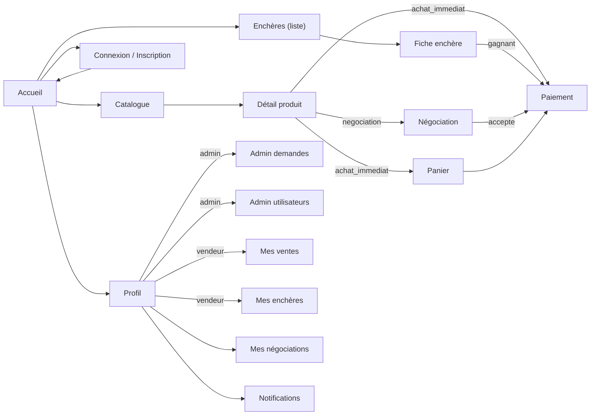

---

## 3. Flux d'initialisation et d'authentification

Le token CSRF est obtenu **avant** toute authentification, dès le démarrage de l'app.

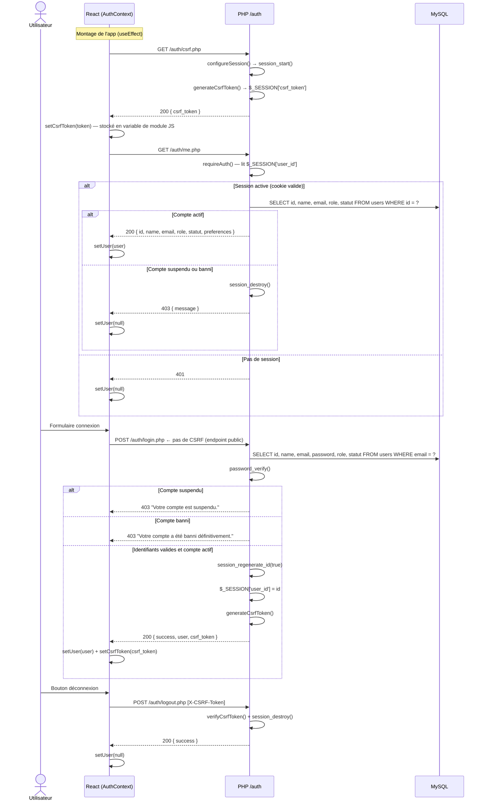

> `register.php` et `login.php` ne vérifient **pas** le CSRF — l'utilisateur n'a pas encore de session.

---

## 4. Flux catalogue et produits

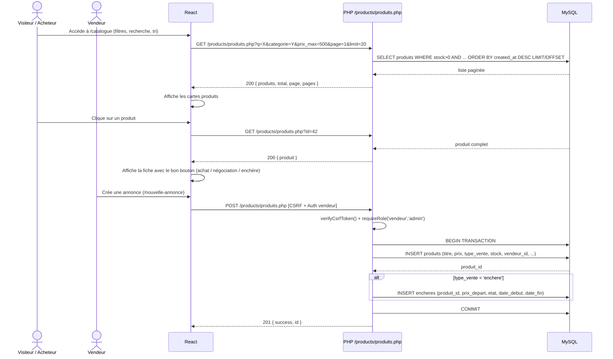

**Filtres disponibles :** `q`, `categorie`, `prix_min`, `prix_max`, `type_vente`, `etat`, `page`, `limit` (max 50).

**Accès CRUD :** GET public · POST/PUT/DELETE réservés au vendeur propriétaire ou admin.

---

## 5. Flux panier et achat immédiat

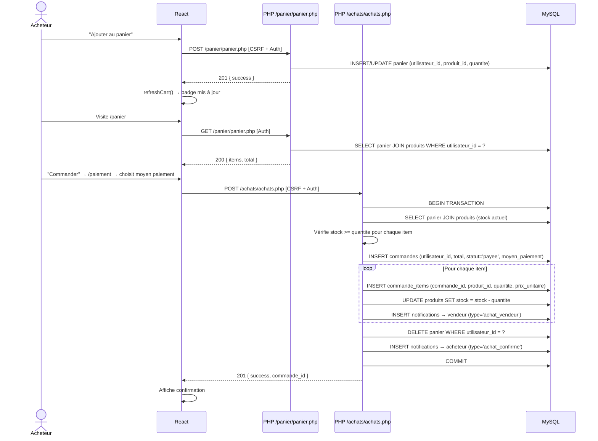

> **Achat direct sans panier** (bouton "Acheter maintenant" sur la fiche produit) : le frontend ajoute d'abord le produit au panier via `POST /panier`, puis enchaîne avec `POST /achats`.

---

## 6. Flux enchères — polling toutes les 3s

Les transitions d'état sont calculées **à chaque lecture** via `transitionnerEtat()` — pas de cron.

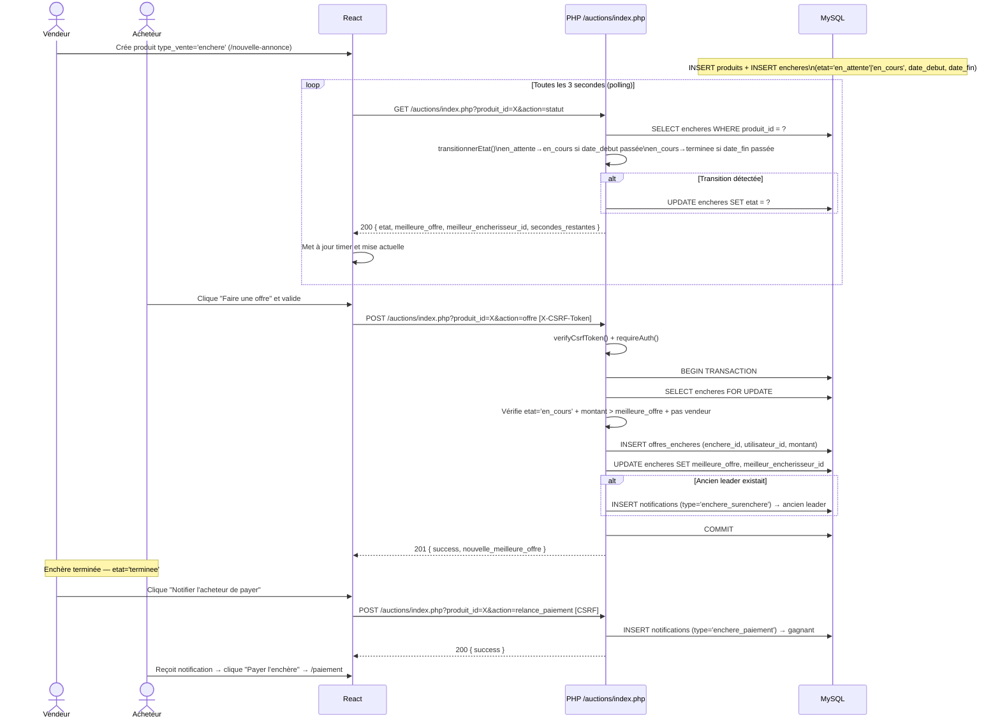

**États de l'enchère :** `en_attente` → `en_cours` → `terminee` | `annulee`

---

## 7. Flux négociation — machine à états

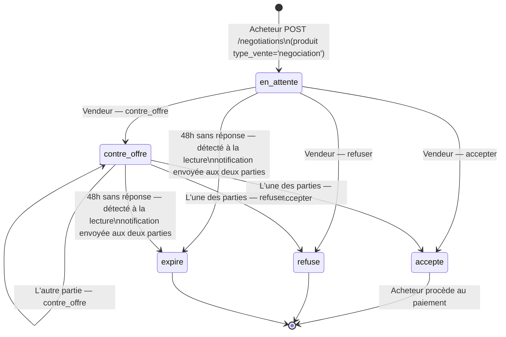

**Règle d'alternance** : `dernier_acteur` (`acheteur` | `vendeur`) empêche la même partie de répondre deux fois de suite.

**Expiration** : `expires_at = NOW() + 48h` — recalculé à chaque réponse. `transitionnerNegociation()` est appelée lors de chaque lecture (liste ET détail) et envoie une notification `negociation_expiree` aux deux parties si l'heure est dépassée.

**Transitions légales** vérifiées côté serveur (`transitionsLegales()`) :

| État courant | `contre_offre` | `accepter` | `refuser` |
|---|---|---|---|
| `en_attente` | → `contre_offre` | → `accepte` | → `refuse` |
| `contre_offre` | → `contre_offre` | → `accepte` | → `refuse` |

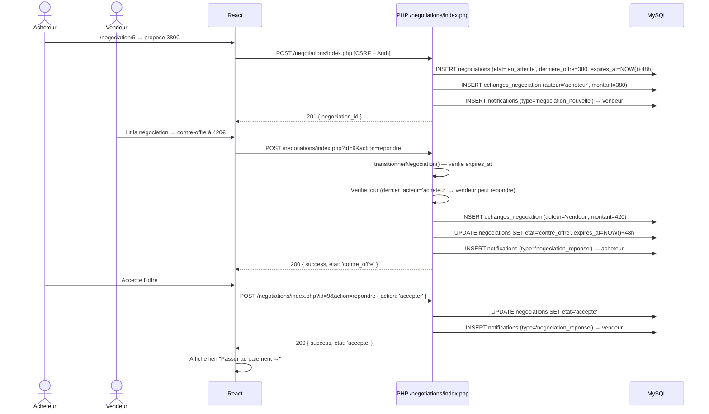

---

## 8. Notifications

Les notifications sont **insérées par le backend** lors d'événements métier. Le frontend les consomme au chargement et après chaque action.

| Type | Déclencheur | Destinataire |
|---|---|---|
| `enchere_surenchere` | Quelqu'un surenchérit | Ancien meilleur enchérisseur |
| `enchere_paiement` | Vendeur relance le gagnant | Gagnant de l'enchère |
| `negociation_nouvelle` | Acheteur initie une négociation | Vendeur |
| `negociation_reponse` | Contre-offre / acceptation / refus | L'autre partie |
| `negociation_expiree` | 48h sans réponse | Acheteur ET vendeur |
| `achat_confirme` | Commande validée | Acheteur |
| `achat_vendeur` | Commande validée (groupé par vendeur) | Chaque vendeur concerné |
| `message_admin` | Admin envoie un message depuis /admin/utilisateurs | Utilisateur ciblé |

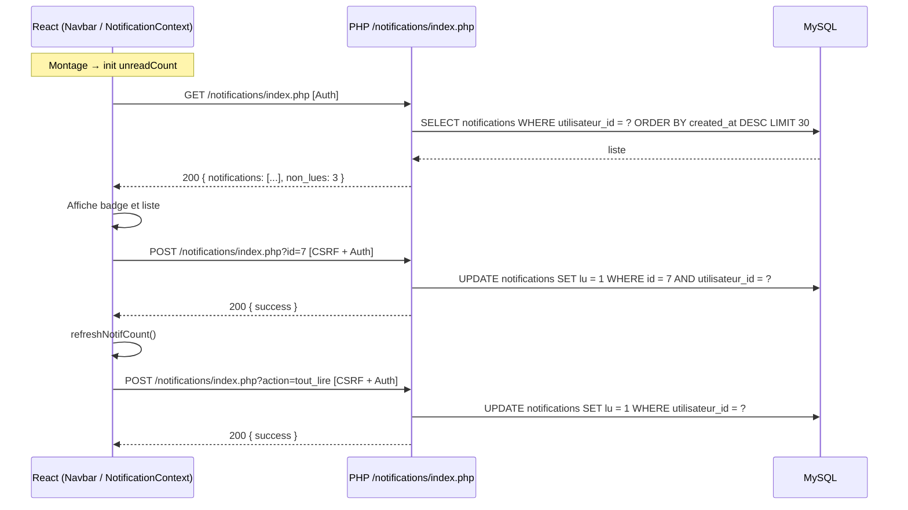

---

## 9. Administration

### 9.1 Modération des demandes vendeur

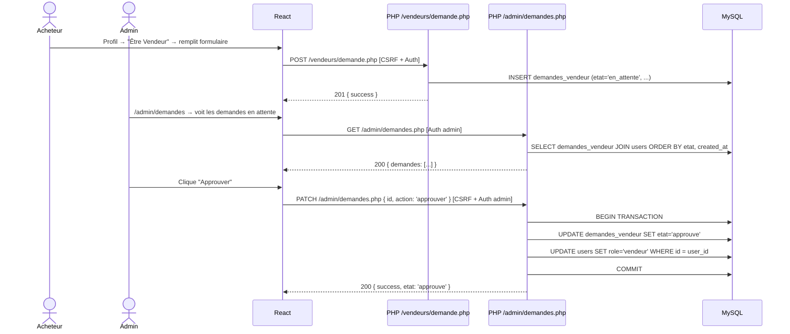

### 9.2 Gestion des utilisateurs

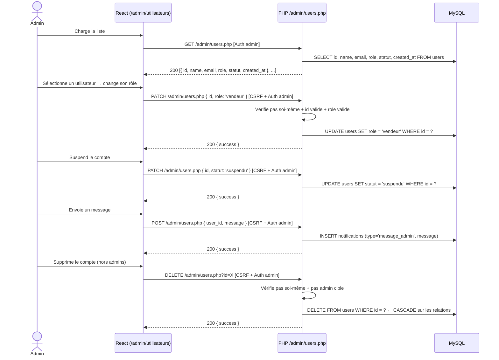

---

## 10. Cycle de vie d'un compte utilisateur

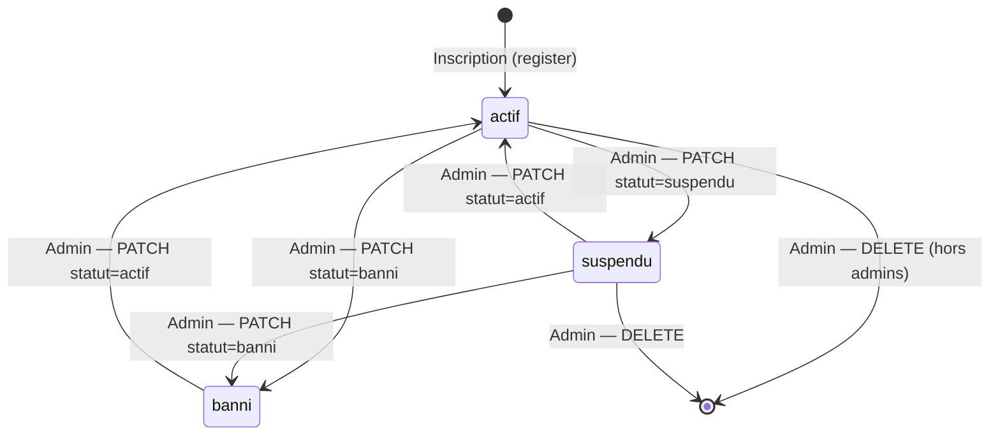

**Effets immédiats d'une suspension ou d'un ban :**
- `POST /auth/login.php` → 403 avec message explicite (connexion impossible)
- `GET /auth/me.php` → si session active, la session est détruite + 403 (déconnexion forcée au prochain rafraîchissement)
- Toutes les routes protégées deviennent inaccessibles

---

## 11. Schéma de base de données complet

```mermaid
erDiagram
    users {
        int id PK
        string name
        string email
        string password
        enum role "acheteur|vendeur|admin"
        enum statut "actif|suspendu|banni"
        string preferences "JSON"
        timestamp created_at
    }
    produits {
        int id PK
        int vendeur_id FK
        string titre
        text description
        decimal prix
        string categorie
        enum etat "neuf|bon_etat|correct|mauvais_etat"
        enum type_vente "achat_immediat|enchere|negociation"
        int stock
        string image_url
        timestamp created_at
    }
    encheres {
        int id PK
        int produit_id FK "UNIQUE"
        decimal prix_depart
        decimal meilleure_offre
        int meilleur_encherisseur_id FK
        enum etat "en_attente|en_cours|terminee|annulee"
        timestamp date_debut
        timestamp date_fin
        timestamp created_at
    }
    offres_encheres {
        int id PK
        int enchere_id FK
        int utilisateur_id FK
        decimal montant
        timestamp created_at
    }
    negociations {
        int id PK
        int produit_id FK
        int acheteur_id FK
        int vendeur_id FK
        enum etat "en_attente|contre_offre|accepte|refuse|expire"
        decimal derniere_offre
        enum dernier_acteur "acheteur|vendeur"
        timestamp expires_at "NOW() + 48h"
        timestamp created_at
        timestamp updated_at
    }
    echanges_negociation {
        int id PK
        int negociation_id FK
        enum auteur "acheteur|vendeur"
        decimal montant
        text message
        timestamp created_at
    }
    panier {
        int id PK
        int utilisateur_id FK
        int produit_id FK
        int quantite
        timestamp created_at
        UNIQUE "utilisateur_id, produit_id"
    }
    commandes {
        int id PK
        int utilisateur_id FK
        decimal total
        enum statut "payee|annulee|remboursee"
        enum moyen_paiement "carte|paypal|virement"
        timestamp created_at
    }
    commande_items {
        int id PK
        int commande_id FK
        int produit_id FK
        int quantite
        decimal prix_unitaire
    }
    notifications {
        int id PK
        int utilisateur_id FK
        string type
        text message
        tinyint lu
        timestamp created_at
    }
    demandes_vendeur {
        int id PK
        int user_id FK "UNIQUE"
        string nom_boutique
        text description
        string categories "JSON"
        string experience
        string site_web
        string telephone
        text motivation
        enum etat "en_attente|approuve|refuse"
        timestamp created_at
        timestamp updated_at
    }

    users ||--o{ produits : "vend"
    users ||--o{ offres_encheres : "enchérit"
    users ||--o{ negociations : "acheteur"
    users ||--o{ negociations : "vendeur"
    users ||--o{ panier : "possède"
    users ||--o{ commandes : "passe"
    users ||--o{ notifications : "reçoit"
    users ||--o| demandes_vendeur : "soumet"
    produits ||--o| encheres : "a une enchère"
    produits ||--o{ negociations : "négocié"
    produits ||--o{ panier : "dans panier"
    produits ||--o{ commande_items : "acheté"
    encheres ||--o{ offres_encheres : "reçoit"
    encheres }o--o| users : "meilleur enchérisseur"
    negociations ||--o{ echanges_negociation : "contient"
    commandes ||--o{ commande_items : "contient"
```

---

## 12. Sécurité — récapitulatif

| Endpoint | Auth | CSRF | Rôle requis |
|---|---|---|---|
| `GET /auth/csrf` | Non | Non | — |
| `POST /auth/register` | Non | Non | — |
| `POST /auth/login` | Non | Non | — |
| `POST /auth/logout` | Oui | Oui | — |
| `GET /auth/me` | Oui | Non | — |
| `GET /products/produits.php` | Non | Non | — |
| `POST/PUT/DELETE /products/produits.php` | Oui | Oui | vendeur, admin |
| `GET /auctions/index.php` (détail/statut) | Non | Non | — |
| `POST /auctions/index.php` (offre/relance) | Oui | Oui | — |
| `GET /negotiations/index.php` | Oui | Non | — |
| `POST /negotiations/index.php` | Oui | Oui | — |
| `GET/POST /panier/panier.php` | Oui | POST : Oui | — |
| `DELETE /panier/panier.php` | Oui | Oui | — |
| `GET/POST /achats/achats.php` | Oui | POST : Oui | — |
| `GET/PUT /profil/profil.php` | Oui | PUT : Oui | — |
| `GET/POST /notifications/index.php` | Oui | POST : Oui | — |
| `GET/POST /vendeurs/demande.php` | Oui | POST : Oui | — |
| `GET /admin/users.php` | Oui | Non | admin |
| `POST/PATCH/DELETE /admin/users.php` | Oui | Oui | admin |
| `GET /admin/demandes.php` | Oui | Non | admin |
| `PATCH /admin/demandes.php` | Oui | Oui | admin |

**Protections spécifiques admin :**
- `PATCH /admin/users.php` : impossible de modifier son propre compte
- `DELETE /admin/users.php` : impossible de supprimer un admin ou son propre compte
- Mots de passe : `password_hash()` / `password_verify()` (bcrypt)
- CSRF : `hash_equals()` (comparaison timing-safe)
- SQL : PDO prepared statements sur toutes les requêtes
- Sessions : `session_regenerate_id()` à chaque login
