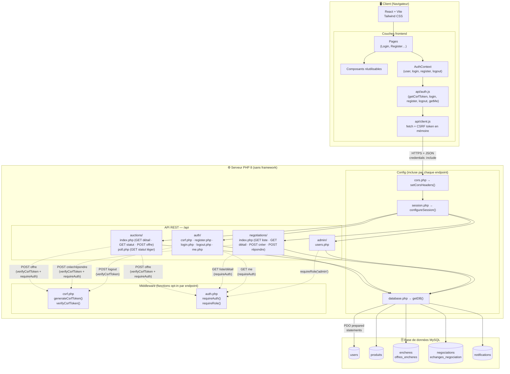
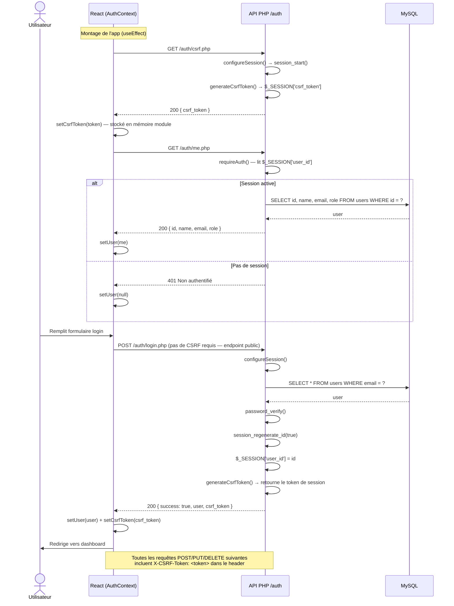
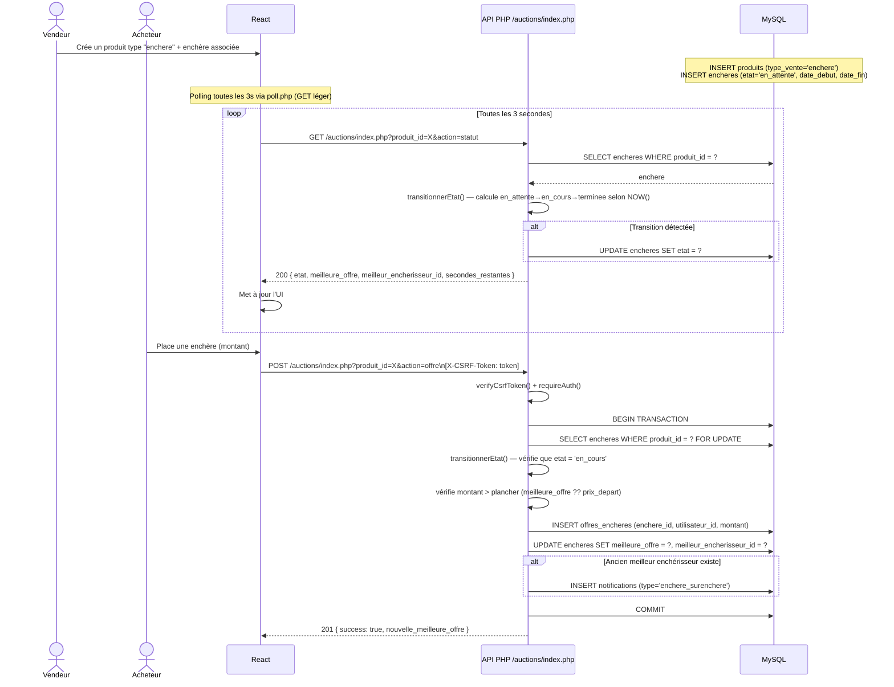
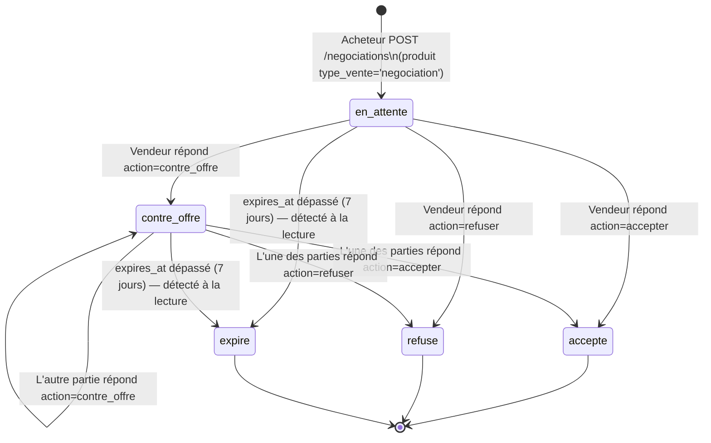
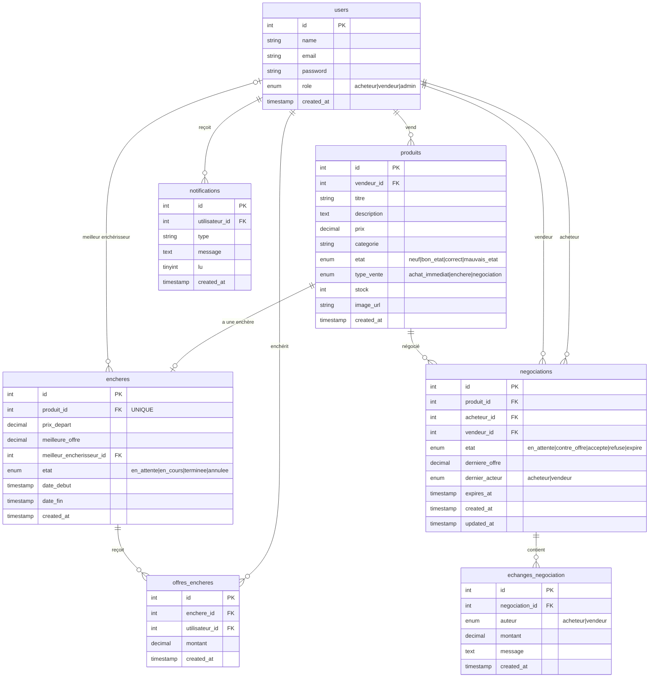

# Mercato Nova — Schéma d'architecture

## 1. Architecture globale

---

## 2. Flux d'initialisation et d'authentification

Le token CSRF est obtenu **avant** toute authentification, dès le démarrage de l'app.

> **Points clés :**
> - `register.php` et `login.php` ne vérifient **pas** le CSRF (l'utilisateur n'a pas encore de session initiale fiable)
> - `logout.php` vérifie le CSRF (la session est active, on peut valider)
> - Le token CSRF est stocké côté serveur dans `$_SESSION['csrf_token']` et côté client en variable de module JS (pas de localStorage)

---

## 3. Flux enchères (avec polling)

Les transitions d'état sont calculées **à la lecture** (pas de cron) via `transitionnerEtat()`.

> **États enchère :** `en_attente` → `en_cours` → `terminee` | `annulee`
> Transitions calculées lazily à chaque appel GET — aucun cron ou worker externe.

---

## 4. Flux négociation (machine à états)

**Règle d'alternance** : le champ `dernier_acteur` (`acheteur` | `vendeur`) empêche la même partie de répondre deux fois de suite. Après l'offre initiale de l'acheteur, c'est au vendeur de répondre, puis alternance.

**Transitions légales** (vérifiées côté serveur) :

| État courant | action=`contre_offre` | action=`accepter` | action=`refuser` |
|---|---|---|---|
| `en_attente` | → `contre_offre` | → `accepte` | → `refuse` |
| `contre_offre` | → `contre_offre` | → `accepte` | → `refuse` |

---

## 5. Schéma de base de données (tables réelles)

