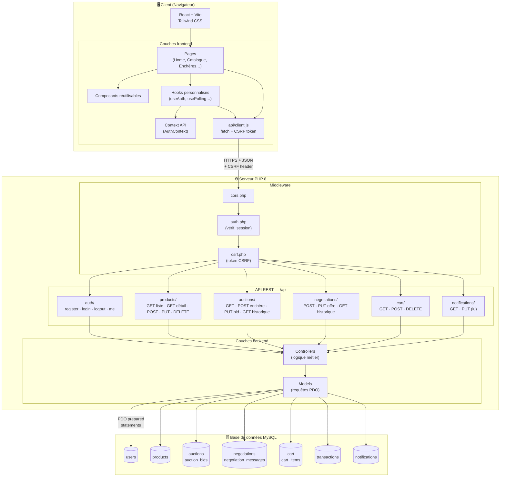
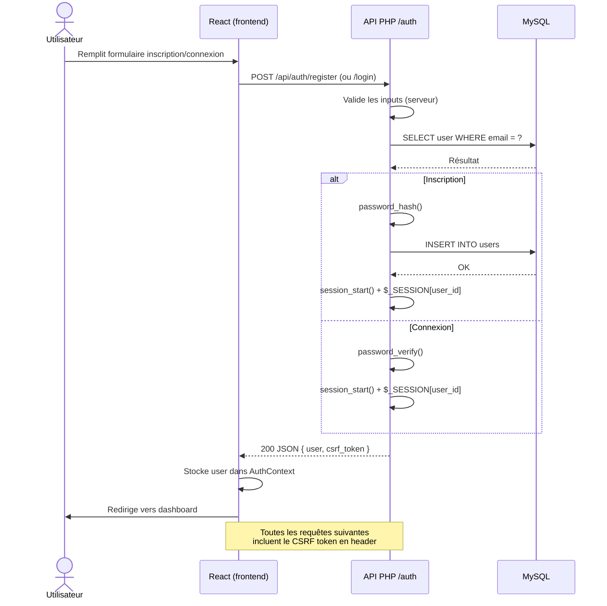
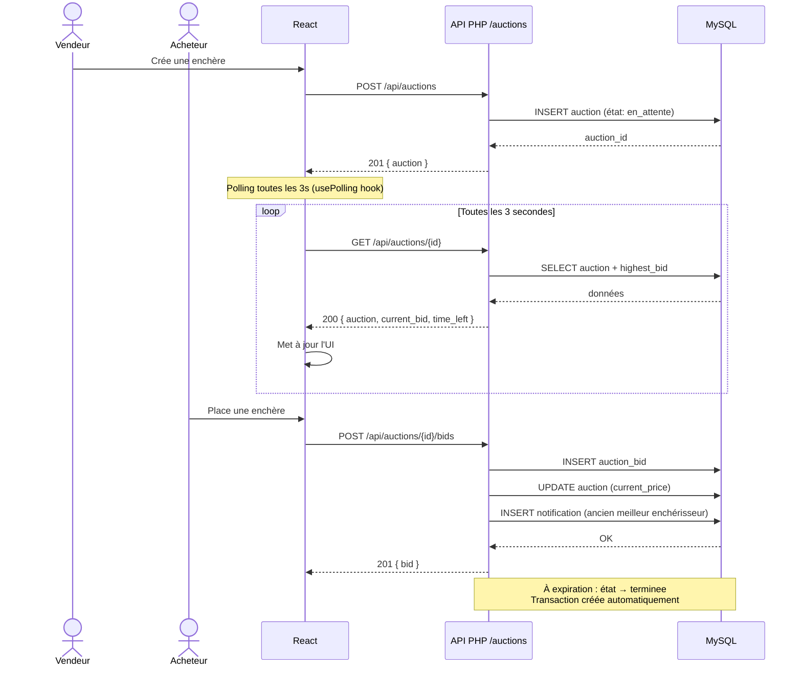
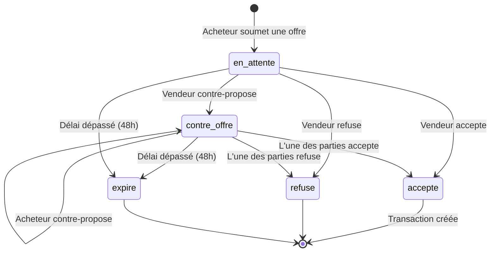
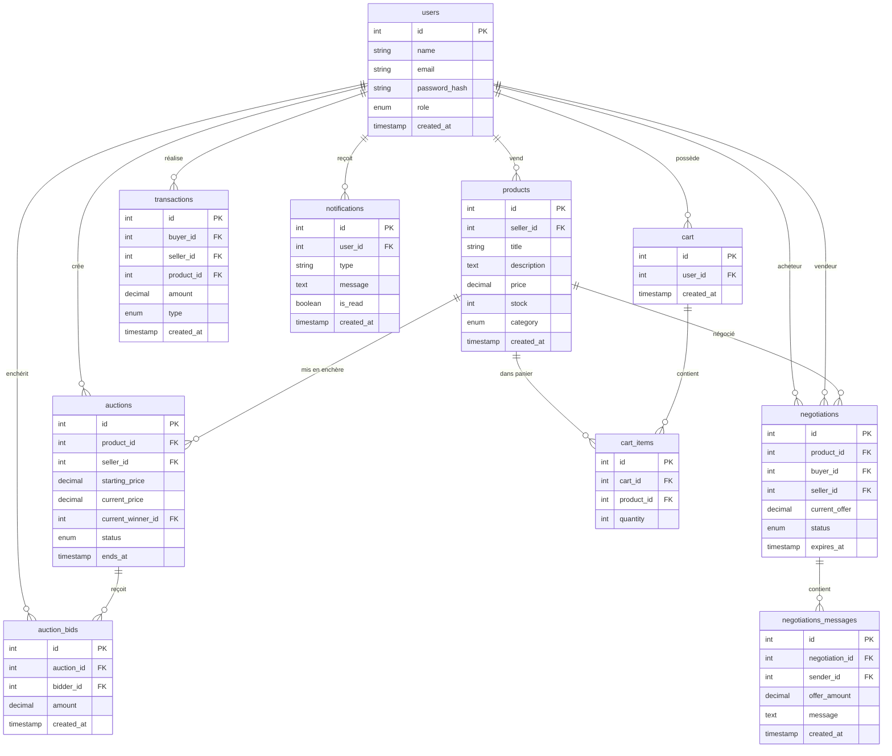

# Mercato Nova — Schéma d'architecture

## 1. Architecture globale

---

## 2. Flux d'authentification

---

## 3. Flux enchères (avec polling)

---

## 4. Flux négociation (machine à états)

---

## 5. Schéma de base de données (résumé)

