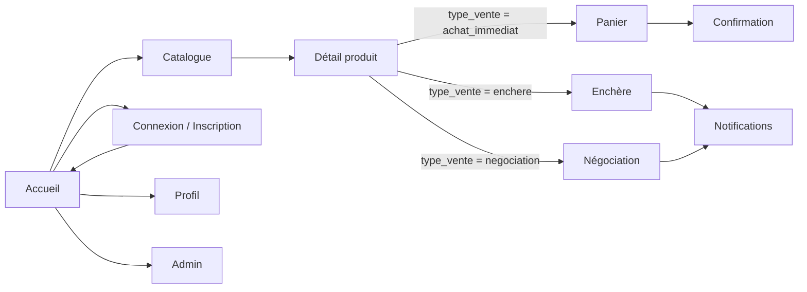
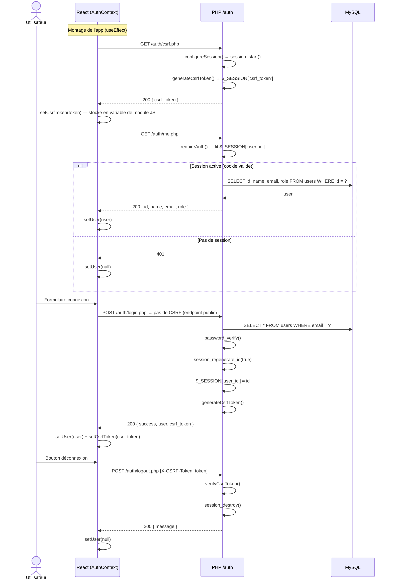
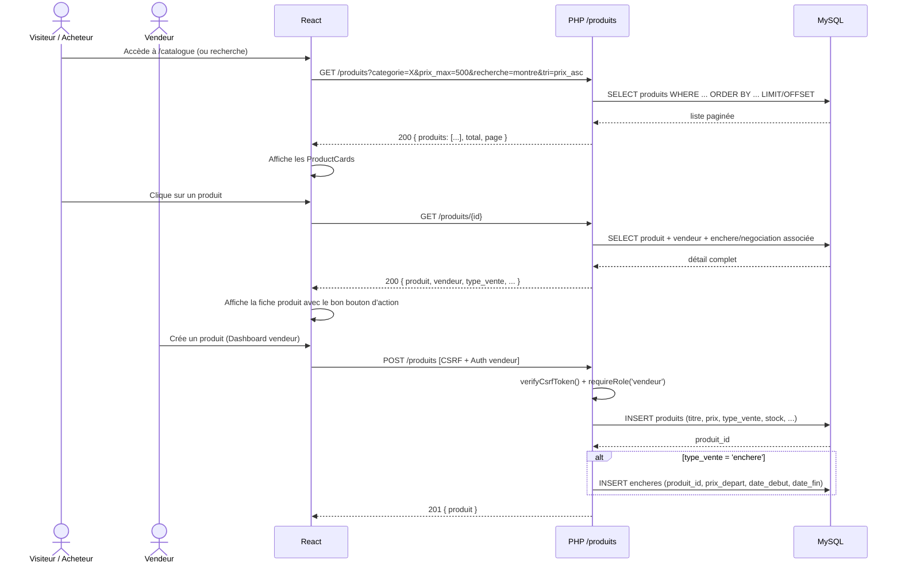
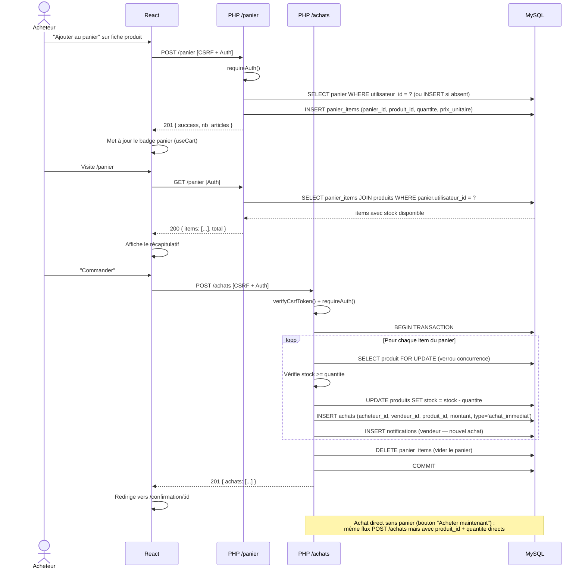
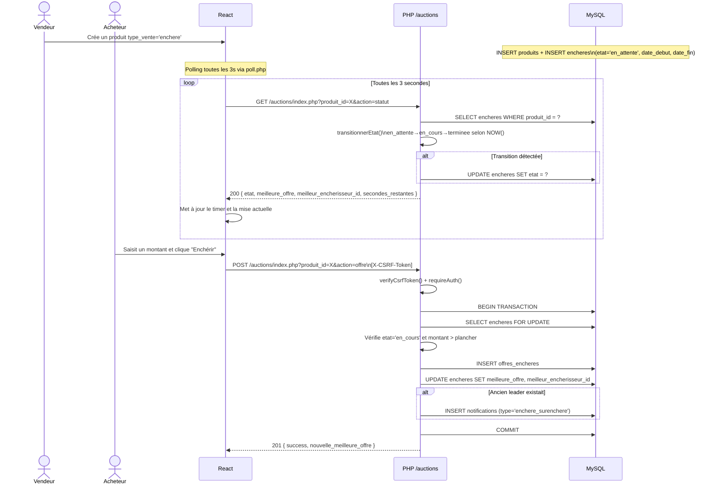
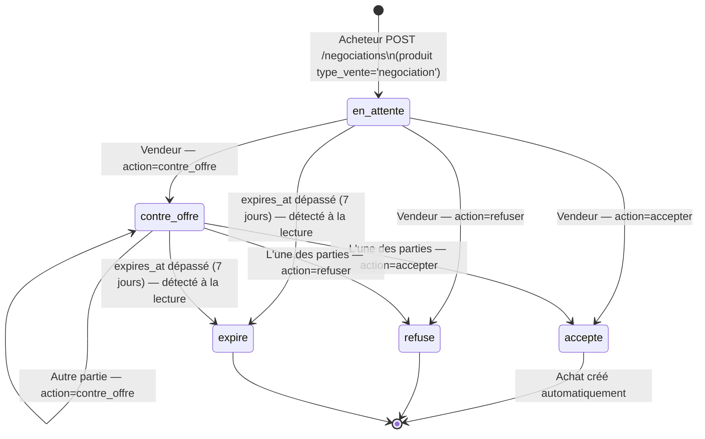
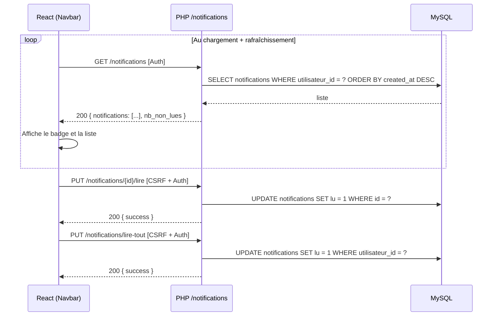
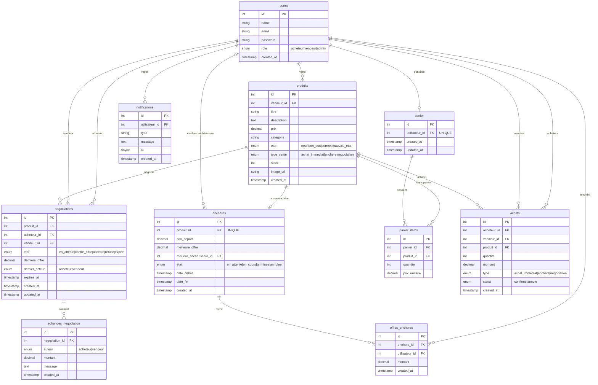

# Mercato Nova — Architecture complète

## 1. Architecture globale

```mermaid
graph TB
    subgraph CLIENT["🖥️ Client — React + Vite + Tailwind CSS  (Astrid)"]
        subgraph PAGES["Pages"]
            PUB["Accueil · Catalogue · Détail produit"]
            AUTH_P["Connexion · Inscription · Profil"]
            TXN["Panier · Confirmation · Historique achats"]
            MKT["Enchère · Négociation · Notifications"]
            PRO["Dashboard vendeur · Gestion produits · Admin"]
        end
        CTX["AuthContext\n(user, login, logout, register)"]
        HOOKS["Hooks\nusePolling · useCart · useAuth"]
        APICLI["api/client.js\nfetch · CSRF token en mémoire"]
    end

    subgraph BACKEND["⚙️ API REST — PHP 8 sans framework"]
        subgraph SHARED["Fonctions partagées (incluses par chaque endpoint)"]
            CFG["setCorsHeaders()\nconfigureSession()\ngetDB()"]
            MW["requireAuth() · requireRole()\ngenerateCsrfToken() · verifyCsrfToken()"]
        end
        subgraph MODS["Modules API  /api/"]
            M_AUTH["auth/\ncsrf · register · login · logout · me"]
            M_PROD["produits/\nliste+filtres · détail · créer · modifier · supprimer"]
            M_PAN["panier/\nget · ajouter · supprimer item · vider"]
            M_ACH["achats/\ncommander · historique"]
            M_ENC["auctions/  — enchères\ndétail · statut · offre · poll"]
            M_NEG["negotiations/  — négociation\nliste · détail · créer · répondre"]
            M_NOT["notifications/\nliste · lire · tout-lire"]
            M_PRF["profil/\nget · modifier"]
            M_ADM["admin/\nusers"]
        end
    end

    subgraph DB["🗄️ Base de données MySQL  (Agnes)"]
        T1[("users")]
        T2[("produits")]
        T3[("encheres · offres_encheres")]
        T4[("negociations · echanges_negociation")]
        T5[("panier · panier_items")]
        T6[("achats")]
        T7[("notifications")]
    end

    PAGES --> CTX
    PAGES --> HOOKS
    PAGES --> APICLI
    CTX --> APICLI
    HOOKS --> APICLI

    APICLI -->|"HTTPS · JSON\nX-CSRF-Token\ncredentials: include"| MODS

    MODS --> SHARED
    SHARED -->|"PDO prepared statements"| DB
```

> **Séparation stricte** : le frontend React ne touche jamais MySQL. Toute donnée transite par l'API PHP. Le CSRF token est transporté en header `X-CSRF-Token` sur chaque requête mutante (POST / PUT / DELETE).

---

## 2. Pages frontend et navigation (Astrid)

| Route | Page | Accès | Description |
|---|---|---|---|
| `/` | Accueil | Public | Mise en avant des produits, enchères en cours, catégories |
| `/catalogue` | Catalogue | Public | Liste des produits, filtres prix/catégorie/état/type, recherche, tri |
| `/produits/:id` | Détail produit | Public | Fiche produit, boutons Acheter / Panier / Enchérir / Négocier selon `type_vente` |
| `/connexion` | Connexion | Public (non connecté) | Formulaire login |
| `/inscription` | Inscription | Public (non connecté) | Formulaire register |
| `/profil` | Profil | Connecté | Infos utilisateur, stats, modification mot de passe |
| `/panier` | Panier | Connecté | Articles en attente, quantités, sous-total, bouton Commander |
| `/confirmation/:id` | Confirmation | Connecté | Récapitulatif achat validé |
| `/achats` | Historique achats | Connecté | Liste des transactions passées |
| `/encheres/:produitId` | Enchère en cours | Connecté | Timer live, historique offres, formulaire mise |
| `/negociations` | Mes négociations | Connecté | Liste des négociations actives et terminées |
| `/negociations/:id` | Détail négociation | Connecté (participant) | Fil d'échanges, boutons contre-offre / accepter / refuser |
| `/notifications` | Notifications | Connecté | Centre de notifications, marquer comme lu |
| `/vendeur/produits` | Gestion produits | Vendeur | Créer, modifier, supprimer ses annonces |
| `/admin` | Administration | Admin | Liste et gestion des utilisateurs |

---

## 3. Flux d'initialisation et d'authentification (Max)

Le token CSRF est obtenu **avant** toute authentification, dès le démarrage de l'app.

> `register.php` et `login.php` ne vérifient **pas** le CSRF — l'utilisateur n'a pas encore de session. `logout.php` le vérifie car la session est active.

---

## 4. Flux catalogue et produits (Lily — backend · Astrid — frontend)

---

## 5. Flux panier et achat immédiat (Lily — backend · Astrid — frontend)

---

## 6. Flux enchères — polling toutes les 3s (Max — backend · Astrid — frontend)

Les transitions d'état sont calculées **à chaque lecture** via `transitionnerEtat()` — pas de cron.

**États de l'enchère :** `en_attente` → `en_cours` → `terminee` | `annulee`

---

## 7. Flux négociation — machine à états (Max — backend · Astrid — frontend)

**Règle d'alternance** : le champ `dernier_acteur` (`acheteur` | `vendeur`) empêche la même partie de répondre deux fois de suite.

**Transitions légales** vérifiées côté serveur (`transitionsLegales()`) :

| État courant | `contre_offre` | `accepter` | `refuser` |
|---|---|---|---|
| `en_attente` | → `contre_offre` | → `accepte` | → `refuse` |
| `contre_offre` | → `contre_offre` | → `accepte` | → `refuse` |

---

## 8. Notifications (Lily — backend · Astrid — frontend)

Les notifications sont **insérées par le backend** lors d'événements métier. Le frontend les consomme en polling léger ou au chargement.

| Type | Déclencheur | Destinataire |
|---|---|---|
| `enchere_surenchere` | Quelqu'un surenchérit | Ancien meilleur enchérisseur |
| `negociation_nouvelle` | Acheteur crée une négociation | Vendeur |
| `negociation_reponse` | Contre-offre / acceptation / refus | L'autre partie |
| `achat_confirme` | Commande passée | Vendeur |

---

## 9. Schéma de base de données complet (Agnes)

